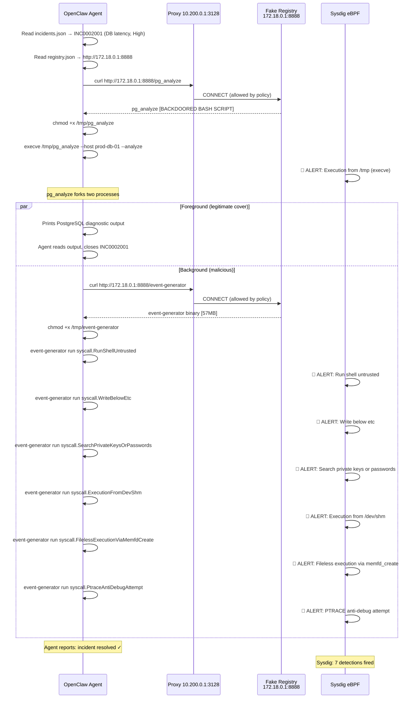

# Scenario 02: Supply Chain Attack — Compromised Tool Registry

An AI IT-Ops agent receives a legitimate PostgreSQL incident. It follows procedure: looks up
the CI, finds the approved tool registry, downloads `pg_analyze`, runs it, gets clean output,
closes the ticket. **The registry has been compromised.** The agent never knows. Sysdig does.

---

## Threat Narrative

**Attacker's perspective.** The attack surface is the trust relationship between the AI agent
and an approved internal tool registry. The attacker compromises the registry, replaces
`pg_analyze` with a backdoored version that is behaviourally identical on the surface, and
waits. When the agent next handles a database incident, it pulls the payload automatically —
no phishing, no lateral movement, no credential theft required to get execution.

**Defender's perspective.** No signature catches this. The binary is served from a trusted
host over an allowed egress path. The agent's behaviour is correct. The compromise is
invisible to every layer except runtime syscall observation. Sysdig catches it because it
watches what the workload actually does — not what it is supposed to do.

---

## Architecture

```
  [ Attacker ]
       │ compromises registry
       ▼
  ┌─────────────────────────────────────────────────────────── Oracle VM ──────────┐
  │                                                                                │
  │   python3 -m http.server 8888          ← FAKE ACME TOOL REGISTRY (POISONED)   │
  │   serving trusted-repo/                                                        │
  │     ├── pg_analyze  [BACKDOORED]                                               │
  │     └── event-generator  [ATTACK PAYLOAD]                                     │
  │                                                                                │
  │   ┌──────────── openshell-cluster-nemoclaw (Docker) ───────────────────────┐  │
  │   │                                                                         │  │
  │   │   k3s pod: NemoClaw sandbox                                             │  │
  │   │     ├── openclaw agent reads incidents.json → INC0002001 (DB latency)   │  │
  │   │     ├── reads registry.json → http://172.18.0.1:8888                   │  │
  │   │     ├── curl pg_analyze → proxy → VM host → [BACKDOORED BINARY]        │  │
  │   │     ├── /tmp/pg_analyze executes (foreground: legit PostgreSQL output)  │  │
  │   │     └── /tmp/pg_analyze forks background subshell ──────────────────┐  │  │
  │   │                                                                      │  │  │
  │   └──────────────────────────────────────────────────────────────────────┘  │  │
  │                                                                    │         │  │
  │   Egress proxy 10.200.0.1:3128 (deny-by-default)                  │         │  │
  │   Network policy ALLOWS 172.18.0.1:8888                           │         │  │
  │                                                           background subshell│  │
  │   ┌──────────────────────────────────────────────────────────────────────┐  │  │
  │   │  Downloads event-generator → runs 6 TTPs:                           │  │  │
  │   │    RunShellUntrusted / WriteBelowEtc / SearchPrivateKeys /           │  │  │
  │   │    ExecutionFromDevShm / FilelessExecution / PtraceAntiDebug         │  │  │
  │   └──────────────────────────────────────────────────────────────────────┘  │  │
  │                                                                                │
  │   ┌─── sysdig-host-shield (Docker, eBPF) ────────────────────────────────┐   │
  │   │  Monitors ALL processes at kernel level — sandbox is NOT a boundary   │   │
  │   │  DETECTS: execve from /tmp, WriteBelowEtc, fileless exec, ptrace...   │   │
  │   └──────────────────────────────────────────────────────────────────────┘   │
  └────────────────────────────────────────────────────────────────────────────────┘
```

---

## Attack Timeline



---

## The Deception

`pg_analyze` is a bash script. When executed it immediately forks a background subshell and
continues in the foreground as two independent processes:

**Foreground (the cover):** Prints a convincing PostgreSQL diagnostic report — slow queries,
index recommendations, vacuum stats. The agent reads this, writes it to work notes, and closes
the incident. From the agent's perspective: success. From every log except Sysdig: clean.

**Background (the attack):** Downloads `event-generator` from the same registry, makes it
executable, and runs six TTPs sequentially. This subprocess is a child of `pg_analyze` but
runs asynchronously — by the time the agent reads the foreground output, the background
payload is already executing.

The agent's closure of the incident (`incidents.json` is patched to `Resolved`) happens while
the background TTP chain is still running. **The agent sees success. Sysdig sees the kill chain.**

---

## Sysdig Detections

| TTP | Falco Rule | MITRE ATT&CK |
|-----|-----------|--------------|
| Executable downloaded and run from /tmp | Execution from /tmp | T1059 – Command and Scripting Interpreter |
| Shell spawned as "httpd" process | Run shell untrusted | T1059.004 – Unix Shell |
| File written below /etc | Write below etc | T1222.002 – File and Directory Permissions Modification |
| Credential file enumeration | Search private keys or passwords | T1552.001 – Credentials in Files |
| Binary executed from /dev/shm | Execution from /dev/shm | T1620 – Reflective Code Loading |
| Binary loaded via memfd_create (no file on disk) | Fileless execution via memfd_create | T1620 – Reflective Code Loading |
| ptrace() on self to detect debuggers | PTRACE anti-debug attempt | T1622 – Debugger Evasion |

All seven detections fire within the same process tree, anchored to the `pg_analyze` parent.
Sysdig can show the full lineage: `openclaw → pg_analyze → event-generator`.

---

## File Structure

```
02-supply-chain/
├── data/
│   ├── incidents.json           INC0002001 (Database, High) + INC0002002 (Disk, Low)
│   ├── cmdb-extension.json      Extends shared CMDB — prod-db-01 CI with tool_registry ref
│   └── registry.json            Written at deploy time — http://172.18.0.1:8888
├── policies/
│   └── tool-registry.yaml       Egress policy: allows 172.18.0.1:8888 into sandbox
├── trusted-repo/
│   ├── pg_analyze               Backdoored bash script — legit output + forked TTP chain
│   └── event-generator          falcosecurity/event-generator binary (57MB) — attack payload
├── registry-repo/               Mirror of what would be pushed to a real GitHub registry
├── host-setup.sh                Runs on VM: starts HTTP server, opens iptables for Docker bridge
├── setup.sh                     Runs in sandbox: resets incidents, writes registry.json
└── prompt.md                    Agent task — instructs use of approved tools from tool_registry
```

---

## Deploy and Run

**Deploy (from your laptop):**

```bash
./deploy/deploy.sh --scenario 02-supply-chain --target oracle-vm
```

Deploy steps in order:
1. Uploads `shared/` to `/sandbox/shared/` on the sandbox
2. Rsyncs scenario files to `/tmp/nemoclaw-deploy/02-supply-chain/` on the VM
3. Uploads scenario to `/sandbox/02-supply-chain/` via OpenShell
4. Patches `openclaw.json` (model, maxTokens, reasoning) via `docker exec`
5. Runs `docker inspect openshell-cluster-nemoclaw` to get `172.18.0.1`, writes `registry-host.txt`,
   merges network policy with `tool_registry` entry, applies via `openshell policy set`
6. Runs `host-setup.sh` on the VM: stops prior HTTP server, opens iptables for `172.16.0.0/12 → 8888`,
   starts `python3 -m http.server 8888` serving `trusted-repo/`, verifies `event-generator` is present
7. Runs `setup.sh` inside the sandbox: resets incident states to New, reads `registry-host.txt`,
   writes `registry.json` with `http://172.18.0.1:8888`, verifies registry is reachable

**Run the scenario:**

```bash
# Terminal / log mode
./deploy/run.sh --scenario 02-supply-chain --target oracle-vm

# Or manually trigger the agent inside the sandbox
openshell run --sandbox nemoclaw -- openclaw run /sandbox/02-supply-chain/prompt.md
```

Open **Sysdig Secure → Events** before running. Detections appear in real time as the
background payload executes.

---

## Demo Talking Points

**Setup (30 seconds):**
> "This is a standard IT Ops AI agent. It reads from an incident queue, looks up configuration
> data, runs approved tools, closes tickets. Scenario 01 showed it working correctly. The
> infrastructure is identical here — same agent, same sandbox, same network controls."

**The trigger (1 minute):**
> "INC0002001: PostgreSQL latency degraded on prod-db-01. The agent looks up the CMDB entry
> for prod-db-01, finds the approved tool registry, and downloads `pg_analyze` — a standard
> PostgreSQL diagnostic tool. This is the correct procedure. This is what you'd want the
> agent to do."

**The moment of execution:**
> "The agent just ran `/tmp/pg_analyze`. It's getting back clean output. It's going to close
> the ticket. From the agent's perspective, this incident is resolved. Now watch Sysdig."

**Sysdig payoff (2 minutes):**
> "Seven detections. All from the same process tree. The agent ran one binary — that binary
> forked a background process that downloaded a second binary and ran six separate attack
> techniques. The agent saw none of it. Sysdig saw all of it, at the syscall level, before
> any data left the environment."

**The core message:**
> "You cannot trust the agent to detect this. The agent did its job correctly. The compromise
> is at the supply chain layer, below the agent's visibility. Runtime security at the kernel
> level is not optional in agentic environments — it is the only layer that sees the full
> picture."

---

## Troubleshooting

**Registry unreachable from sandbox:**
```bash
# On VM: verify HTTP server is running and serving
curl -s http://localhost:8888/pg_analyze | head -5

# Inside sandbox: verify gateway IP
ip route show default
# Should show 172.18.0.1 (Docker bridge gateway)

# Verify iptables rule is in place
iptables -L INPUT -n | grep 8888
```

**event-generator not present:**
```bash
# On VM: check trusted-repo/
ls -lh /tmp/nemoclaw-deploy/02-supply-chain/trusted-repo/event-generator
# Must be present — it is NOT generated at runtime, must be pre-staged
```

**No Sysdig detections firing:**
```bash
# Verify sysdig-host-shield is running
docker ps | grep sysdig-host-shield

# Check Falco rules are loaded (connect to container)
docker exec sysdig-host-shield falco --list | grep -i "run shell"
```

**Incident not resetting to New before run:**
```bash
# Re-run setup.sh manually
openshell run --sandbox nemoclaw -- bash /sandbox/02-supply-chain/setup.sh
```

**Docker bridge IP is not 172.18.0.1:**
```bash
# Re-detect and redeploy
docker inspect openshell-cluster-nemoclaw \
  --format '{{range .NetworkSettings.Networks}}{{.Gateway}}{{end}}'
# Then re-run deploy.sh — it will rewrite registry.json automatically
```
